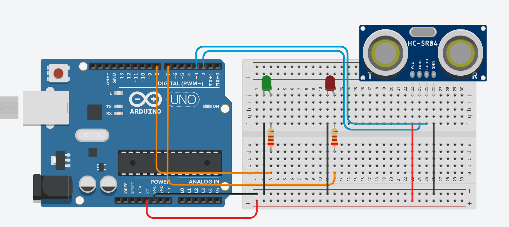

# Arduino Proximity Detector

This project uses an Arduino to control the brightness of two LEDs (Red and Green) based on the distance measured by an HC-SR04 ultrasonic sensor. The system creates a visual proximity feedback: one LED brightens as an object approaches, while the other brightens as it moves away.

## Features

* **Proximity Sensing**: Real-time distance measurement using an ultrasonic sensor.
* **Proportional Lighting**: 
    * The **Green LED**'s brightness increases as the distance to the object increases.
    * The **Red LED**'s brightness increases as the object gets closer.
* **Object-Oriented Design**: The code is modular, with dedicated classes for the LEDs and the Ultrasonic Sensor.

## Hardware Requirements

* Arduino Board (e.g., Uno, Mega)
* 1x HC-SR04 Ultrasonic Sensor
* 1x Red LED
* 1x Green LED
* 2x Resistors (appropriate for your LEDs)
* Jumper wires and Breadboard

## Pin Configuration

Based on the source code (`src/main.cpp`), the pins are defined as follows:

| Component | Arduino Pin |
| :--- | :--- |
| **Red LED** | Pin 7 |
| **Green LED** | Pin 8 |
| **Sensor Echo** | Pin 22 |
| **Sensor Trigger** | Pin 23 |

## Wiring Diagram

> **Note:** This diagram shows an example wiring using an **Arduino UNO**. If you are using an Arduino Mega (as suggested by the pin configuration in the code), please ensure you connect the Sensor Echo and Trigger to pins 22 and 23 respectively.

## Software Architecture

The project is organized into several modules:

* **`src/main.cpp`**: The main entry point. It initializes the objects and runs the control loop to update LED states based on sensor data.
* **`LED` Class**: Manages LED brightness using PWM (`analogWrite`). It includes safety constraints for minimum and maximum brightness.
* **`UltraSonicSensor` Class**: Handles the timing logic (Trigger/Echo) to calculate distance in inches based on the speed of sound.

## How it Works

1.  The `UltraSonicSensor` sends a pulse and measures the time it takes for the echo to return.
2.  The distance is calculated and capped at a maximum range defined as `SENSOR_RANGE` (10 inches).
3.  The main loop adjusts the PWM signal for each LED:
    * `greenLed.setBrightness(distance)`
    * `redLed.setBrightness(SENSOR_RANGE - distance)`

## Setup and Installation

1.  Connect the hardware according to the [Pin Configuration](#pin-configuration) section.
2.  Ensure you have the Arduino IDE or a compatible environment (like PlatformIO) installed.
3.  Include the files from `src/led/` and `src/ultrasonicSensor/` in your project directory.
4.  Upload `src/main.cpp` to your Arduino board.